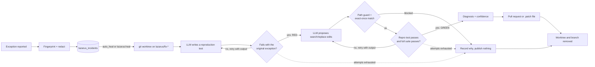

# Lazarus

[](https://github.com/mohammedname2002/laravel-lazarus/actions/workflows/ci.yml)


**Self-healing Laravel apps.** When your application throws in production, Lazarus writes a test
that reproduces the bug, proves it fails, finds a minimal patch, proves the test now passes *and*
the rest of your suite still does, then opens a pull request with the whole case. A human merges
it or doesn't. If any step can't be proven, nothing is published and you are told why.

Example output (illustrative):

```text
$ php artisan lazarus:heal 3

  Lazarus is healing incident #3 with anthropic:claude-sonnet-5
  DivisionByZeroError: Division by zero
  app/Services/InvoiceCalculator.php:26 · seen 14 time(s)

  ● Preparing an isolated worktree...
  ✔ Worktree /tmp/lazarus-worktrees/5c1e0f9a2b-3fa91c on branch lazarus/fix-5c1e0f9a2b 0.4s
  ● Writing a test that reproduces the bug...
  ✔ Reproduced in tests/Feature/Lazarus/FreeSampleInvoiceTest.php (red after 1.9s, attempt 1) 9.8s
    │ FAILED  Tests\Feature\Lazarus\FreeSampleInvoiceTest > it prices a free sample
    │ DivisionByZeroError: Division by zero
  ● Proposing a minimal patch...
  ✔ Return zero when an invoice has no units (1 edit in app/Services/InvoiceCalculator.php) 6.2s
  ● Verifying the patch...
  ✔ Reproduction test is green (1.7s) and the full suite passes (8.3s) 10.1s
  ● Writing the diagnosis...
  ✔ averageUnitPrice() divides by the summed quantity, which is zero for free samples (confidence 92%) 3.9s
  ● Publishing the fix for review...
  ✔ Pull request opened: https://github.com/acme/shop/pull/128 1.6s
```

## The problem

An exception tracker tells you *that* something broke. Then a developer still has to read the
trace, guess the input, write a failing test, fix it and prove nothing else broke, usually for a
bug that turns out to be a one-line guard. AI tools can suggest that line, but a suggestion is not
evidence: nobody should merge a patch that was never shown to fix the failure it claims to fix.

Lazarus only ever hands you **evidence**: a test that fails on your current code with the same
exception production saw, the same test passing with the patch, and your full suite green.

## How it works



1. **Capture.** A reportable callback turns every reported exception into an incident. The
   fingerprint is the exception class, the innermost *application* frame (vendor frames are
   skipped) and the message with ids, numbers, UUIDs and hashes stripped, so 10,000 occurrences
   of one bug are one row. The stack, code snippets, full source of the involved files, route,
   method, input and recent queries are stored, already redacted.
2. **Isolate.** Each heal runs in a throwaway `git worktree` on `lazarus/fix-{fingerprint}`. Your
   working tree is never touched, and Lazarus refuses to start if it has uncommitted changes
   (the worktree is built from `HEAD`, so a dirty tree would mean testing different code).
3. **Red.** The model returns a test file. Lazarus writes it and runs it with your own test
   runner. It only counts if it **fails** and the output mentions the original exception class
   or message. Otherwise the model gets the real output and tries again.
4. **Patch.** The model returns search/replace edits, never whole files. Every search block must
   match exactly once, every path must pass the path guard, and a patch may not edit tests.
5. **Green.** The reproduction test must now pass, then your full suite must pass. A patch that
   fails either is reverted and sent back with the output.
6. **Publish.** A diagnosis with a confidence score is written, the fix is committed on the
   branch and published as a draft pull request (or a `.patch` file). Lazarus never merges.

## The 60-second demo

<!-- GIF: docs/demo.gif, recorded with examples/demo-app.md -->
> **Demo GIF coming soon.** Break a fresh Laravel app, run `php artisan lazarus:heal 1`, watch the
> red run, the patch and the green suite scroll by, then open the pull request that just arrived.

The demo will show a fresh Laravel app with an `InvoiceCalculator` that divides by zero when an
invoice only contains free samples. Visiting the page returns a 500; `lazarus:list` shows the
incident; `lazarus:heal 1` reproduces it, patches it and verifies it live; the pull request lands
on GitHub with the diagnosis, the test, the diff and both test runs. Every step to reproduce it is
in [`examples/demo-app.md`](examples/demo-app.md).

## Requirements

- PHP 8.2+ and Laravel 11 or 12
- `git` on the machine that runs heals (2.31+ for token-safe pushes)
- A Pest or PHPUnit test suite
- An LLM: Anthropic, OpenAI or a local Ollama model

## Installation

The package is not on Packagist yet. Until it is, add the repository to your app's
`composer.json` first:

```json
"repositories": [
    { "type": "vcs", "url": "https://github.com/mohammedname2002/laravel-lazarus" }
]
```

```bash
composer require mohammedname2002/laravel-lazarus:dev-main
php artisan vendor:publish --tag=lazarus-config
php artisan migrate
php artisan lazarus:doctor
```

The service provider is auto-discovered and starts capturing immediately. Healing starts when you
ask for it (or when you turn on `auto_heal`).

## Configuration

Everything lives in `config/lazarus.php`; the common settings come from the environment:

```dotenv
LAZARUS_LLM=anthropic              # anthropic, openai, ollama
ANTHROPIC_API_KEY=sk-ant-...
LAZARUS_ANTHROPIC_MODEL=claude-sonnet-5

LAZARUS_PUBLISHER=github           # or "patch" (default, no credentials needed)
LAZARUS_GITHUB_TOKEN=github_pat_...   # contents: write, pull requests: write
LAZARUS_GITHUB_REPOSITORY=acme/shop   # optional, read from the origin remote otherwise

LAZARUS_AUTO_HEAL=false            # queue a heal as soon as a new incident is captured
LAZARUS_DAILY_TOKENS=300000
LAZARUS_DAILY_COST=5.00
```

| Option | Default | What it does |
| --- | --- | --- |
| `environments` | production, staging, local | Where exceptions are captured |
| `ignore` | auth, validation, 404/HTTP, CSRF | Exception classes that are never incidents |
| `auto_heal` | `false` | Queue `HealIncident` for new incidents |
| `cooldown_minutes` / `max_heals_per_day` | 60 / 10 | Throttle automatic heals |
| `max_test_attempts` / `max_patch_attempts` | 3 / 2 | How many tries each proof gets |
| `sandbox.writable` | `app/`, `tests/`, `routes/` | Where the model may write (the denylist still wins) |
| `sandbox.copy_files` | `.env`, `.env.testing` | Untracked files your suite needs in the worktree |
| `testing.command` / `suite_command` | auto (Pest or PHPUnit) | Override, e.g. `['{php}', '{vendor}/bin/pest', '--parallel']` |
| `testing.test_timeout` / `suite_timeout` | 120 / 900 s | Hard process timeouts |
| `publishers.github.draft` | `true` | Open pull requests as drafts |

## Commands

| Command | Purpose |
| --- | --- |
| `lazarus:list [--status=] [--limit=]` | Incidents, occurrences, status and outcome (PR link or failure reason) |
| `lazarus:heal {incident} [--queue]` | Heal one incident with live, step-by-step output |
| `lazarus:doctor` | Checks git, worktree creation, the test runner, the database, the API key, the GitHub token and the remaining budget |
| `lazarus:ignore {incident}` | Never heal this incident; occurrences are still counted |

`{incident}` is the numeric id or any unique prefix of the fingerprint.

## Safety model

### Why it never auto-merges

Lazarus proves that a patch fixes *the failure it reproduced* and breaks *no existing test*. It
cannot prove that the reproduction matches what your users meant to do, that your suite covers
everything that matters, or that the fix is the one your team wants. That judgement is a code
review, so the output is always a pull request (a draft by default) or a patch file. There is no
merge code path in the package.

### Redaction

Every stored context and every outgoing LLM request passes through the `Redactor`, including the
test output that is fed back to the model:

- values of sensitive keys: `password`, `token`, `secret`, `api_key`, `authorization`, `cookie`,
  `client_secret`, `private_key`, `card_number`, `cvv`, `ssn` and more (substring match, any case)
- every secret value from your `.env` file wherever it appears (configuration values such as
  `APP_NAME` or `DB_CONNECTION` are deliberately left alone)
- bearer tokens, JWTs and well-known key formats (Anthropic, OpenAI, GitHub, AWS, Slack, Stripe)
- `Authorization` and `Cookie` headers, `?token=` style query parameters
- email addresses and card numbers that pass the Luhn check

### Path guard

The model can only create or edit files under `sandbox.writable`. A hard denylist that
configuration cannot override always wins: `.env*`, `.git/`, `vendor/`, `node_modules/`, `config/`,
`bootstrap/`, `storage/`, `public/`, `database/migrations/`, CI workflows, `composer.*`,
`package*.json`, `phpunit.xml*`, `tests/Pest.php` and `tests/TestCase.php`. Absolute paths and `..`
are rejected, and writes through symlinks that leave the worktree are refused. A patch that trips
the guard ends the heal immediately; it is not retried. Patches may not edit tests at all, and
the reproduction test must be a new file, so the model cannot make a suite green by weakening it.

### Test processes

Tests the model wrote are code you did not write, so they run with a scrubbed environment: only
what PHP and git need to start (`PATH`, `HOME`, `TEMP`...) is inherited. API keys, the GitHub
token and, most importantly, your production `DB_*` variables never reach them. Every process has
a hard timeout. The GitHub token reaches git through `GIT_CONFIG_*` environment variables, never
the command line or the remote URL.

### Budget

`TokenBudget` enforces a daily token and dollar ceiling across all heals. It is checked before
every model call; once it is exhausted, heals fail with the reason instead of spending more.
Tokens and cost are stored per incident and shown on every pull request.

## LLM drivers

| Driver | Default model | Cost | Notes |
| --- | --- | --- | --- |
| `anthropic` | `claude-sonnet-5` | $2 / $10 per million tokens | Messages API through Laravel's HTTP client |
| `openai` | `gpt-5` | $1.25 / $10 per million tokens | Chat Completions in JSON mode; any compatible `base_url` |
| `ollama` | `qwen2.5-coder` | **free** | **Runs locally: your code never leaves the machine** |
| `fake` | - | free | Scripted responses for tests |

Prices only feed the budget and the cost line on the pull request; adjust `pricing` if your
contract differs.

**Ollama is the private option.** Point Lazarus at a local model and the whole pipeline, source
code, stack traces and all, stays on your hardware, at no cost:

```bash
ollama pull qwen2.5-coder
```

```dotenv
LAZARUS_LLM=ollama
OLLAMA_BASE_URL=http://localhost:11434
LAZARUS_OLLAMA_MODEL=qwen2.5-coder
```

Smaller local models fail more proofs than hosted ones; when they do, Lazarus simply publishes
nothing. Every response, from any driver, must be strict JSON validated into a readonly DTO; an
invalid answer is sent back with the exact validation error. Add your own driver with
`app(LlmManager::class)->extend('name', fn () => new MyDriver)`.

## Events

| Event | When |
| --- | --- |
| `IncidentCaptured` | An exception was recorded (`isNew` tells a first occurrence from a repeat) |
| `ReproductionConfirmed` | A test fails with the original exception (red) |
| `ReproductionFailed` | No attempt produced a valid reproduction |
| `FixVerified` | The test is green and the full suite passes |
| `PullRequestOpened` | The pull request exists; carries the URL and the full report |
| `HealingFailed` | A heal stopped; carries the stage and the reason |
| `HealingStepStarted` / `HealingStepCompleted` | Progress for each pipeline step (drives `lazarus:heal`) |

```php
Event::listen(PullRequestOpened::class, fn ($event) => Slack::send("Lazarus fixed {$event->incident->shortClass()}: {$event->url}"));
```

## Testing

```bash
composer test       # Pest
composer analyse    # PHPStan, level max
composer lint:check # Pint
```

The suite has unit tests for the fingerprinter, the redactor, the path guard, JSON validation,
search/replace edits and the budget, and an **end-to-end suite that runs the real pipeline**: it
creates a throwaway git repository holding a small project with a real divide-by-zero bug and its
own Pest suite, triggers the bug in a separate PHP process, then heals it with a real worktree,
real test runs, a real commit and a real patch file that `git am` applies. Only the model is
scripted. The negative cases prove that a test that doesn't reproduce is rejected, a patch that
doesn't fix (or breaks the suite) is rejected, a patch touching `.env` or the tests is blocked, a
dirty tree is refused, and that no secret from the fixture's `.env` ever reaches the model.
Another end-to-end test pushes to a local bare remote and checks the pull request request body.

On Windows with XAMPP, `pdo_sqlite` is shipped but disabled; run
`php -d extension=pdo_sqlite vendor/bin/pest`.

## Limitations

Lazarus is honest about what it can prove, and these are the cases where it usually can't:

- **Only bugs a test can reproduce.** Failures that depend on production data, third-party APIs,
  timing, queues or infrastructure are usually not reproducible from the context it has. Those
  heals fail with a recorded reason; they don't produce guesses.
- **Your test suite is the safety net.** "The full suite passes" is only as strong as the suite.
  That is the main reason a human reviews every fix.
- **Model-written tests run on the healing machine.** The environment is scrubbed and paths are
  guarded, but the code still executes. Run heals where you run CI (a staging box or a container),
  not on a production web server, and make sure `phpunit.xml` pins a test database.
- **The worktree reuses your `vendor/`.** Instead of a slow `composer install`, an
  `auto_prepend_file` overlay maps your PSR-4 namespaces onto the worktree. Composer `files`
  autoloads and classmap-only code still load from the main checkout, and a patch cannot change
  dependencies. Untracked build output (such as `public/build` for `@vite`) is not in the
  worktree unless you add it to `copy_files`.
- **Fingerprints include the line number,** so an unrelated edit above the throw site creates a
  new incident after the next deploy.
- **Pest and PHPUnit only,** and GitHub only for pull requests (the patch publisher works anywhere).

## License

Lazarus is open-source software licensed under the [MIT license](LICENSE).
